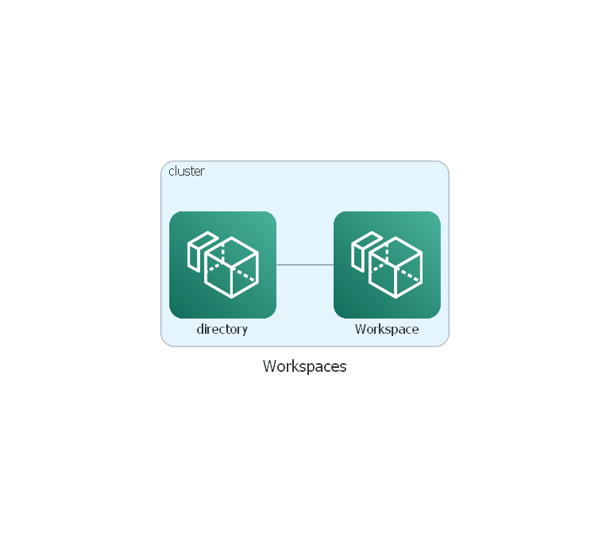

# terraform-aws-workspaces

[](https://github.com/JamesWoolfenden/terraform-aws-workspaces)
[](https://github.com/JamesWoolfenden/terraform-aws-workspaces/releases/latest)
[](https://github.com/JamesWoolfenden/terraform-aws-workspaces/releases/latest)

[](https://www.bridgecrew.cloud/link/badge?vcs=github&fullRepo=JamesWoolfenden%2Fterraform-aws-workspaces&benchmark=CIS+AWS+V1.2)
[](https://github.com/pre-commit/pre-commit)
[](https://www.checkov.io/)
[](https://www.bridgecrew.cloud/link/badge?vcs=github&fullRepo=JamesWoolfenden%2Fterraform-aws-workspaces&benchmark=INFRASTRUCTURE+SECURITY)

Draft module to create AWS Workspaces.

## Usage

This is a very basic example (so far).



To implement include af file in your repository in your existing Terraform code:

```hcl
module "workspaces" {
  source                 = "jameswoolfenden/workspaces/aws"
  version                = "v0.0.11"
  common_tags            = var.common_tags
}
```

## Detailed Notes

<!-- BEGINNING OF PRE-COMMIT-TERRAFORM DOCS HOOK -->
## Requirements

No requirements.

## Providers

| Name | Version |
|------|---------|
| <a name="provider_aws"></a> [aws](#provider\_aws) | n/a |

## Modules

No modules.

## Resources

| Name | Type |
|------|------|
| [aws_workspaces_directory.main](https://registry.terraform.io/providers/hashicorp/aws/latest/docs/resources/workspaces_directory) | resource |
| [aws_workspaces_workspace.example](https://registry.terraform.io/providers/hashicorp/aws/latest/docs/resources/workspaces_workspace) | resource |
| [aws_directory_service_directory.example](https://registry.terraform.io/providers/hashicorp/aws/latest/docs/data-sources/directory_service_directory) | data source |
| [aws_workspaces_bundle.bundle](https://registry.terraform.io/providers/hashicorp/aws/latest/docs/data-sources/workspaces_bundle) | data source |

## Inputs

| Name | Description | Type | Default | Required |
|------|-------------|------|---------|:--------:|
| <a name="input_bundle_id"></a> [bundle\_id](#input\_bundle\_id) | (optional) describe your variable | `string` | `"wsb-bh8rsxt14"` | no |
| <a name="input_common_tags"></a> [common\_tags](#input\_common\_tags) | This is to help you add tags to your cloud objects | `map(any)` | n/a | yes |
| <a name="input_directory_id"></a> [directory\_id](#input\_directory\_id) | (optional) describe your variable | `string` | n/a | yes |
| <a name="input_root_volume_encryption_enabled"></a> [root\_volume\_encryption\_enabled](#input\_root\_volume\_encryption\_enabled) | n/a | `bool` | `true` | no |
| <a name="input_user_name"></a> [user\_name](#input\_user\_name) | n/a | `string` | n/a | yes |
| <a name="input_user_volume_encryption_enabled"></a> [user\_volume\_encryption\_enabled](#input\_user\_volume\_encryption\_enabled) | n/a | `bool` | `true` | no |
| <a name="input_volume_encryption_key"></a> [volume\_encryption\_key](#input\_volume\_encryption\_key) | (optional) describe your variable | `string` | `"alias/aws/workspaces"` | no |

## Outputs

| Name | Description |
|------|-------------|
| <a name="output_directory"></a> [directory](#output\_directory) | The directory |
| <a name="output_workspace"></a> [workspace](#output\_workspace) | The workspace |
<!-- END OF PRE-COMMIT-TERRAFORM DOCS HOOK -->

## Policy

This is the policy required to build this project:

<!-- BEGINNING OF PRE-COMMIT-PIKE DOCS HOOK -->
The Terraform resource required is:

```golang
resource "aws_iam_policy" "terraform_pike" {
  name_prefix = "terraform_pike"
  path        = "/"
  description = "Pike Autogenerated policy from IAC"

  policy = jsonencode({
    "Version": "2012-10-17",
    "Statement": [
        {
            "Sid": "VisualEditor0",
            "Effect": "Allow",
            "Action": [
                "workspaces:DescribeWorkspaceBundles"
            ],
            "Resource": [
                "*"
            ]
        }
    ]
})
}


```
<!-- END OF PRE-COMMIT-PIKE DOCS HOOK -->

## Related Projects

Check out these related projects.

- [terraform-aws-codecommit](https://github.com/jameswoolfenden/terraform-aws-workspaces) - Storing ones code

## Help

**Got a question?**

File a GitHub [issue](https://github.com/jameswoolfenden/terraform-aws-workspaces/issues).

## Contributing

### Bug Reports & Feature Requests

Please use the [issue tracker](https://github.com/jameswoolfenden/terraform-aws-workspaces/issues) to report any bugs or file feature requests.

## Copyrights

Copyright © 2019-2023 James Woolfenden

## License

[](https://opensource.org/licenses/Apache-2.0)

See [LICENSE](LICENSE) for full details.

Licensed to the Apache Software Foundation (ASF) under one
or more contributor license agreements. See the NOTICE file
distributed with this work for additional information
regarding copyright ownership. The ASF licenses this file
to you under the Apache License, Version 2.0 (the
"License"); you may not use this file except in compliance
with the License. You may obtain a copy of the License at

<https://www.apache.org/licenses/LICENSE-2.0>

Unless required by applicable law or agreed to in writing,
software distributed under the License is distributed on an
"AS IS" BASIS, WITHOUT WARRANTIES OR CONDITIONS OF ANY
KIND, either express or implied. See the License for the
specific language governing permissions and limitations
under the License.

### Contributors

[![James Woolfenden][jameswoolfenden_avatar]][jameswoolfenden_homepage]<br/>[James Woolfenden][jameswoolfenden_homepage]

[jameswoolfenden_homepage]: https://github.com/jameswoolfenden
[jameswoolfenden_avatar]: https://github.com/jameswoolfenden.png?size=150
